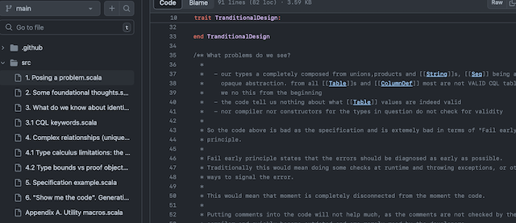

# (Hopefully) motivational talk on using Scala as a specification language

The code is in [src](https://github.com/p-pavel/scala-typelevel-motivational/tree/main/src) folder,
I will collect it hear as text. PLEASE take a look inside the `src`, the code IS mostly
text and organised as a book:

This is work-in-progress intended to be finished today, 2024-06-28,
so if you are interested, check the page periodically or look at the [commits](https://github.com/p-pavel/scala-typelevel-motivational/commits/main/).

I started my journey with software engineering ~30 years ago,
professionally worked with C, C++, Java, Smalltalk, C#, Python, Haskell, Agda, Scala,
and more.

I currently see the microservices catastrophe marching and the rise of ancient evil like Go.

My interests include:

- Scala as an industrial-grade specification language
  - type-level and meta-programming utilities
  - development of [tagless final ideas](https://duckduckgo.com/?q=tagless+final+interpreters&t=osx&ia=web) for
    Scala and its capabilities (see [this](https://github.com/p-pavel/osgi-scala-maven/tree/main/modelling) to get a high level picture)
  - development of [parametric parametricity](https://www2.cs.sfu.ca/CourseCentral/831/burton/Notes/July14/free.pdf)
    ideas for Scala
  - development of techniques and tools to push Scala into proof assistant
    similar to Agda (ability to discuss the topic with the type checker)
  - express industrial knowledge as the Scala specs and develop the libraries from this
    (consider industrial patterns like "event sourcing", or "CQRS" expressed not as
    words but as formal executable spec)
  - develop the techniques for API design and evolution connected to the types in Scala
    - Can I pass the immutable source files to the developers and if they come with
      something that will make this code compile I can be pretty sure they
      implemented the spec? (yes, we can run Scalacheck and munit in compile time)
    - Can API evolution be connected to subtyping?
    - - Can the structure of our specs reflect the stages of the design, including
        elaboration and refinement leading to more and precise types?
- software engineering with Scala on the JVM using OSGi and general capability/requirement model and packages
  in the JVM sense
  - a tool to automatically generate OSGi bundles and Karaf feature repositories
    from Scala libraries (the development of [this theme](https://github.com/p-pavel/osgi-scala))
- IDE to support proper Scala development which isolates the developer from dealing with project and
  dependencies focusing on automatically finding the dependencies from Maven Central. Tightly integrated with
  OSGi container to get the illusion of live code development and automating proper OSGi bundle creation

Unfortunately, there're little chances to continue this work due to time limitations (limiting factor being the cigarettes and food supply and also accommodation) and the lack of general interest in the topic.

But if you are interested, please consider [sponsorship](https://github.com/sponsors/p-pavel) and participating
in the [discussions](https://github.com/p-pavel/scala-typelevel-motivational/discussions).

From my experience in latest years I can't make living from being a software engineer, so this is an experiment with
alternatives. Your sponsorship will allow me to buy a pack of cigarettes or two, maybe some food or even
pay the rent, so I can continue on the list above.
